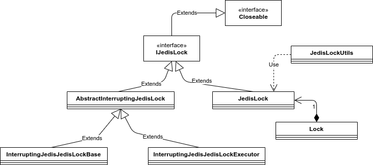

# InterruptingJedisLocks

## Basics

If you want to use Redis and java library Jedis to control resources and locks between threads and processes, take a look into this library.

### Locks

Here there is a basic Redis-Jedis based distributed lock implementation, that can lock a resource between threads and processes.

Also, an interrupting lock is a Jedis based lock which interrupts the lock owner thread if the leasing time is out

The basic interface is ``IJedisLock``, which all implemented locks must follow.  
The basic implementation is ``JedisLock``, also other classes use this class.  
The class ``Lock`` is the reimplementation of ``java.util.concurrent.locksLock`` with a ``JedisLock`` backend, if needed. It only can be generated from a JedisLock object.  
  
The ``AbstractInterruptingLock`` has the main code of an interrupting lock, and two implementing classes
- ``InterruptingLockBase`` will create a new background thread to control the leasing time
- ``InterruptingLockExecutor`` will use a ExecutorService to retrieve a  thread to control the leasing time

Obviously, for a lock to be used between two or more independent threads or procesess, they must share the same name.  

The ``IJedisLock`` interface is ``Closeable``, so you can use it in a try/catch with resources.  
Also, you can put your critical section under a lamda on the ``underLock`` method, that will execute this code opening and closing the lock before/after.  
``JedisLockUtils`` is a static shortcut to this method on a lock, in shake of simplicity.     

##### Rationale and example of use of an interruping lock:  

Imagine you have a file in a shared folder that many processes want to write.  
1. A distribute lock on Redis will do it.  
1. You create the lock and set a timeout, with the same data to all the threads and processes.   
1. When the lock is granted to a process it begins to write on the file.  
1. When the lock expires, another process can write.   
1. **But the first process can, and will, continue be writing to the file**. You must interrupt this first thread, or errors will follow.  
 - Becuse the value on redis will expire and allow other threads to take the lock, but the java process will not be affected by a expiration on redis server !  

The interrupting lock uses a background thread that will interrupts the main writing thread when the lease time is out, allowing the other threads to access the resouce. The redis instance that hold the lock will expire the lock variable, so other threads can be granted to the lock.  

### Semaphore

Redis based semaphore that works like a normal Java semaphore but it is distributed, works in different threads and processes that can access a redis server.  
A semaphore with the same name on different threads/processes shares the same number on permits on any moment.

The class ``JedisSemaphore``, like the standart Java one, is the one that implements the semaphore.
  

## Test 

The tests are done to check the most common use cases of the lock and the semaphore.    

The tests under functional packages are launched against a real redis instalation. You can configure them in the JedisTestFactory class, in the proper package.    
To make them run (by default are disbaled ) use the variable ``FUNCTIONAL_TEST_CYCLES``, by putting a value ditinct to zero. 

## Extra

Jedis is a Java library to use a Redis server with Java, at a low-level commands
https://github.com/xetorthio/jedis

WORK IN PROGRESS !!!  
UNDER CONSTRUCTION !!!

Made with
- Intellij
- https://pandao.github.io/editor.md/en.html 
- Draw io https://app.diagrams.net/
